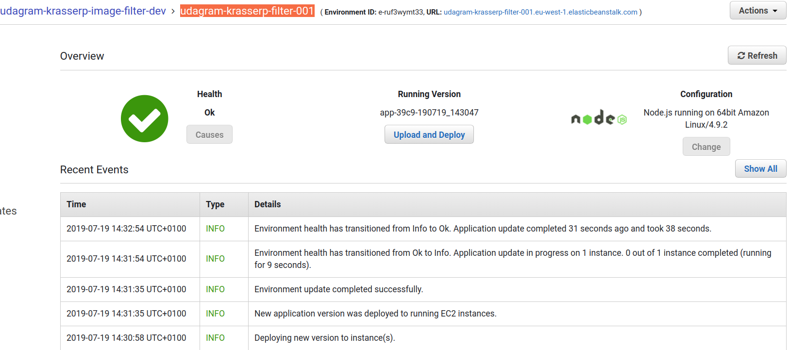

# Udagram Image Filtering Microservice

## Tasks

### Prerequisites:
To emulate the aws eb service also locally we use `python 2.7` 

To do so we are using [pipenv](https://github.com/pypa/pipenv). If you haven't installed this please do so. 

To set this up please run 
```
$ pipenv install
```
then

```
$ pipenv shell
$ python --version
```
You should see something like `Python 2.7.12` 


### Setup Node Enviornment

You'll need to create a new node server. Open a new terminal within the project directory and run:

1. Initialize a new project: `npm i`
2. run the development server with `npm run dev`

### Create a new endpoint in the server.ts file

Created new endPoint `.src/controllers/v0/filterImage/routes/filterImage.route.ts`

This enables the following endpoint when the server is started:
`http://{{HOST}}/filteredimage?image_url={{imgURL}`

HOST : `localhost:8082`
imgURL: `https://timedotcom.files.wordpress.com/2019/03/kitten-report.jpg`

### Test locally

1.) start the server
`npm run dev`
2.) open this url in a browser:
`http://localhost:8082/filteredimage?image_url=https://timedotcom.files.wordpress.com/2019/03/kitten-report.jpg`

### Test on aws eb

1.) Try this link:
`http://udagram-krasserp-filter-001.eu-west-1.elasticbeanstalk.com/filteredimage?image_url=https://timedotcom.files.wordpress.com/2019/03/kitten-report.jpg`

### Test via postman

The postman collection included has been updated to the aws eb domain in {{HOST}}.
`./cloud-cdnd-c2-final.postman_collection.json`

### Deployment

Please review

```
./ebextensions
./elasticbeanstalk
./package.json -> npm run build
```

#### aws eb screenshot


